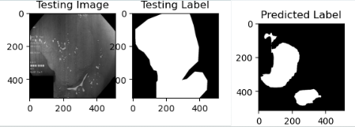

## Table of Contents
1. [Project Overview](#project-overview)
2. [Features](#features)
3. [Technologies Used](#technologies-used)
4. [Datasets](#datasets)
5. [Model Architecture](#model-architecture)
6. [Installation and Setup](#installation-and-setup)
7. [Usage](#usage)
8. [Results](#results)
9. [Contributing](#contributing)

## Project Overview

This project gives an overview of two widely popular CNN models named **UNET** and  **Attention UNET** by analysing thd same for **polyp segmentation** from colonoscopy images. Polyp detection is crucial for the early diagnosis of colorectal cancer, and accurate segmentation of polyps is important for medical practitioners. This model leverages the **Attention UNET** architecture, which enhances the traditional UNET model by adding attention mechanisms to focus on relevant features during segmentation tasks.

The project uses **Kvasir** and **CVC-ClinicDB** datasets for training and testing, achieving high segmentation accuracy, with a focus on improving precision for medical imaging.

## Features

- **UNET** & **Attention UNET** architecture for precise polyp segmentation.
- Uses **Kvasir** and **CVC-ClinicDB** datasets, which are widely recognized in medical imaging research.
- Implements attention mechanisms to enhance the model’s focus on relevant features during segmentation.
- High accuracy of **92%** in segmentation tasks, optimized for real-world clinical applications.

## Technologies Used

- **Programming Language:** Python
- **Deep Learning Framework:** Tensorflow, Keras
- **Libraries:** NumPy, OpenCV, Matplotlib, Scikit-learn
- **Model:** UNET and Attention UNET (modified UNET with attention gates)
- **GPU:** NVIDIA Tesla T4 of google colab (optional but recommended for training DNNs)

## Datasets

The following datasets were used for training and evaluation:

1. **Kvasir Dataset**:
    - Contains colonoscopy images with annotations for polyps.
    - [Kvasir Dataset Link](https://datasets.simula.no/kvasir/)

2. **CVC-ClinicDB Dataset**:
    - Another dataset providing polyp segmentation annotations from colonoscopy images.
    - [CVC-ClinicDB Dataset Link](https://www.kaggle.com/datasets/balraj98/cvcclinicdb)

Both datasets were preprocessed to resize images to **256x256** and were split into **training**, **validation**, and **test** sets.

## Model Architecture

The model architecture is based on the **UNET** model, with an added **attention mechanism**. This mechanism allows the model to focus on the most relevant parts of the image, thereby improving segmentation accuracy for complex medical images like polyps.

### Attention UNET Architecture:

- **Encoder**: Downsampling path that captures spatial information.
- **Decoder**: Upsampling path to reconstruct the image at the original resolution.

### Attention UNET Architecture:

- **Encoder**: Downsampling path that captures spatial information.
- **Decoder**: Upsampling path to reconstruct the image at the original resolution.
- **Attention Gates**: Applied at each skip connection, which helps the model focus on important features.
- **Loss Function**: Binary Cross-Entropy Loss with Dice Coefficient to balance between pixel-wise classification and segmentation performance.

## Installation and Setup

To run this project locally, follow the steps below:

1. **Clone the repository:**
    ```bash
    git clone https://github.com/palpratik56/AUNET.git
    ```
2. **Navigate to the project directory:**
    ```bash
    cd AUNET
    ```
3. **Install the required dependencies:**
    ```bash
    pip install -r requirements.txt
    ```
4. **Download the datasets:**
    - Download and place the **Kvasir** and **CVC-ClinicDB** datasets in the appropriate folder (e.g., `data/`).
    - Ensure that the datasets are split into **train**, **validation**, and **test** sets.

5. **Train the model:**
    ```bash
    python train.py --epochs 50 --batch_size 16
    ```

6. **Test the model:**
    ```bash
    python test.py --weights_path "path_to_saved_model_weights"
    ```

## Usage

Once the model is trained, you can use it for segmentation by running the following command:

```bash
python predict.py --image_path "path_to_input_image" --weights_path "path_to_saved_model_weights"
```

This will output the segmented mask of the input image, highlighting the polyps.

## Results

The model achieved **92% accuracy** in polyp segmentation tasks on the test datasets, demonstrating high precision and recall in identifying polyps. Below are some performance metrics:

| Metric             | Value |
|--------------------|-------|
| Dice Coefficient    | 0.92  |
| Jaccard Index       | 0.88  |
| Accuracy            | 92%   |

Example segmented image:



## Contributing

Contributions to improve the model or extend its capabilities are welcome!

1. Fork the project
2. Create a feature branch (`git checkout -b feature/newFeature`)
3. Commit your changes (`git commit -m 'Add newFeature'`)
4. Push to the branch (`git push origin feature/newFeature`)
5. Open a pull request
